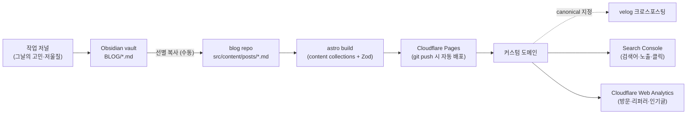

# 개인 기술 블로그 — 설계 문서

> **이 문서는 다른 레포/다른 세션에서 블로그를 실제로 구현할 때 쓰는 단독 설계서다.**
> 이 저장소(`study-with-claude`)에서는 구현하지 않는다. 여기엔 문서만 둔다.
>
> - 작성일: 2026-08-03
> - 작성 배경: "이력서에 내가 어떤 고민을 하는 사람인지 드러내고 싶다" + "유입 분석도 하고 싶다"는 논의 결과
> - 상태: **설계 확정, 구현 전**

---

## 0. 새 세션에서 이 문서를 읽었다면

이 문서 하나로 시작할 수 있게 썼다. 순서는 이렇다.

1. **§1 목적**과 **§13 하지 말 것**을 먼저 읽는다. (이 프로젝트의 실패 모드가 §13에 있다)
2. **§2 의사결정 기록**을 읽고 스택이 왜 이렇게 정해졌는지 확인한다. 뒤집고 싶으면 여기 근거부터 반박할 것.
3. **§12 마일스톤 M0**부터 순서대로 구현한다.
4. 구현 중 결정이 바뀌면 **§2에 ADR을 추가**하고(기존 항목을 지우지 말 것) §15 열린 질문을 갱신한다.

---

## 1. 목적과 성공 기준

### 1.1 목적 (우선순위 순)

1. **"어떤 고민을 하고 문제를 어떻게 푸는 사람인가"를 드러내는 글의 발행처.** 이력서·포트폴리오에서 링크 하나로 가리킬 수 있는 허브.
2. **흩어진 결과물의 집결지.** GitHub / 강의 학습기록 / 프로젝트가 한 도메인 아래 모인다.
3. **사이트 자체가 코드 샘플.** 프론트엔드 직군에서 개인 사이트는 취향·성능 감각·판단력이 3초 만에 읽히는 물건이다.

### 1.2 명시적 비목표

- ❌ **트래픽/조회수 극대화가 아니다.** (근거: §2 ADR-000)
- ❌ **CMS·댓글·검색을 다 갖춘 완성형 플랫폼이 아니다.** 글이 늘어나면 그때 붙인다.
- ❌ **Next.js 학습용 실험장이 아니다.** 학습 실습은 별도 playground에서 한다. (근거: §2 ADR-002)

### 1.3 성공 기준 (측정 가능한 것만)

| # | 기준 | 검증 방법 |
|---|---|---|
| S1 | 커스텀 도메인으로 접속되고 HTTPS가 걸린다 | 브라우저 |
| S2 | **글 3편**이 발행되어 있다 | `/posts` 목록 |
| S3 | 글 상세 페이지의 클라이언트 JS 총량 **≤ 10kB** (gzip 전) | DevTools Network |
| S4 | Lighthouse Performance / SEO / Best Practices **≥ 95** | Lighthouse |
| S5 | Search Console에 사이트맵이 제출되고 색인이 잡힌다 | GSC |
| S6 | Obsidian에서 글 하나 쓰고 → **커밋 → 배포까지 10분 이내** | 실측 |

**S6이 가장 중요하다.** 발행 마찰이 크면 글이 안 나오고, 글이 없으면 나머지 기준은 전부 무의미하다.

---

## 2. 의사결정 기록 (ADR)

> 각 항목은 **결정 / 근거 / 버린 대안 / 뒤집는 조건** 순이다. 뒤집는 조건이 충족되면 새 ADR을 추가한다.

### ADR-000 — 목표 지표를 "노출"이 아니라 "지속 발행"으로 잡는다

- **결정**: 조회수/유입량을 KPI로 삼지 않는다. "꾸준히 갱신되는 상태"를 KPI로 삼는다.
- **근거**:
  - 2026년 데이터에서 AI Overviews가 1위 결과 클릭을 **평균 34.5% 감소**시켰고, 적응하지 않은 사이트의 정보성 쿼리 트래픽은 **20~40% 하락**했다. 튜토리얼성 글로 유입을 뽑는 전략은 구조적으로 수명이 끝나가는 중이다.
  - 한국 채용 쪽 통념도 같다 — 블로그 주소는 **필수가 아니라 참고자료**이고, **관리되지 않는 블로그는 오히려 감점**이다. 평가되는 건 조회수가 아니라 "바쁜 와중에 갱신한 흔적"이다.
  - AI가 합성할 수 없는 글(=원본 판단·저울질·실패 기록)이 인용되는 쪽으로 이동 중이다. 이건 목적 §1.1과 정확히 같은 방향이다.
- **버린 대안**: SEO 키워드 타겟팅 중심 운영, `llms.txt` 추가 → **구글이 `llms.txt`를 무시한다고 공식 확인**했다. 넣지 않는다.
- **뒤집는 조건**: 블로그를 수익화하거나 제품 유입 채널로 쓰기로 목적이 바뀔 때.

### ADR-001 — 프레임워크는 **Astro**

- **결정**: Astro (2026년 2월 안정판 기준 **Astro 6**) + 필요한 곳만 React island.
- **근거**:
  - 2026년 SSG 지형에서 **Astro가 콘텐츠 우선 사이트의 기본값**으로 정리됐다.
  - **제로 JS가 기본값**이다. 컴포넌트는 명시하지 않으면 HTML로만 렌더되고 JS가 제거된다. 글 50개 블로그가 총 **2~5kB JS**로 끝난다. → 성공 기준 S3/S4를 스택 차원에서 보장한다.
  - **React를 포기하지 않아도 된다.** island는 격리 렌더되므로 댓글·검색 등 인터랙션이 필요한 조각만 `client:*`로 하이드레이션한다.
  - **Content Collections**가 frontmatter를 Zod로 검증한다 → 오타가 빌드 전에 잡힌다 (§5).
  - 생태계 소멸 리스크가 낮다: **2026-01-16 Cloudflare가 Astro 팀을 인수**하며 오픈소스 유지를 명시했다. (대조: Contentlayer는 유지보수 중단, Gatsby는 쇠퇴)
- **버린 대안**:
  - **Jekyll** — 2026년엔 "GitHub Pages용 간단 블로그" 니치로 축소. Ruby 의존성 + 느린 빌드라는 두 번째 런타임을 떠안을 이유가 없다.
  - **Next.js** — ADR-002 참고.
  - **Deno/Fresh ("Dino"로 언급된 것)** — 정체 미확인(§15 Q3). 블로그 목적으로는 생태계가 얇다.
- **뒤집는 조건**: 인증·대시보드·개인화 피드 등 "의미 있는 앱 동작"이 필요해질 때 → 그땐 Next.js.

### ADR-002 — 블로그를 Next.js 학습장으로 겸하지 않는다

- **결정**: 블로그는 Astro로 짓고, Next.js 학습은 별도 playground에서 계속한다.
- **근거**: 이 프로젝트의 최빈 실패 모드는 "사이트는 예쁜데 글이 0개"다. 블로그가 실험장을 겸하면 캐싱/렌더링 실험에 시간이 흡수되어 §1.3 S2가 깨진다.
- **버린 대안**: Next.js App Router + **Velite** 또는 **Content Collections**(Contentlayer의 드롭인 후속). 기술적으로는 충분히 유효한 선택지다 — 단 **Contentlayer는 유지보수 중단이므로 어떤 경우에도 쓰지 않는다.**
- **뒤집는 조건**: 이력서에서 "Next.js 실무 깊이"를 블로그로 증명해야 하는 상황이 생길 때. (그때도 블로그 이전이 아니라 별도 서브도메인 프로젝트를 권장)

### ADR-003 — 호스팅은 **Cloudflare Pages**

- **결정**: Cloudflare Pages + 커스텀 도메인. 어댑터는 기본 static 출력으로 시작.
- **근거**: Astro 팀이 Cloudflare 소속이라 **`@astrojs/cloudflare` 어댑터가 Astro 6에서 재작성**됐고 우선 지원 대상이다. 무료 티어로 충분하고, **Cloudflare Web Analytics(ADR-004)를 코드 변경 없이 토글로 켤 수 있다.**
- **버린 대안**: Vercel(Next에 최적, Astro도 무난 — 나중에 Next 프로젝트를 붙일 계획이면 재검토), GitHub Pages(커스텀 빌드/헤더 제어가 약함).
- **뒤집는 조건**: Server Islands / SSR이 필요해지고 Cloudflare Workers 런타임 제약에 막힐 때.

### ADR-004 — 계측은 **Search Console + Cloudflare Web Analytics** 2층으로 시작, GA4는 보류

- **결정**: M1에 GSC와 Cloudflare Web Analytics만 붙인다. GA4는 글 10편 이후 재검토.
- **근거**:
  - **독자층이 하필 GA를 가장 많이 차단하는 집단이다.** 기술·개발자 독자의 GA4 차단률은 **40~60%**, 기술 사이트는 50%를 넘기기도 한다. 서버 로그 대조 시 **GA가 25~40% 적게 집계**된다. 총량은 감으로 보정해도 **글 간 인기 순위가 뒤집히는 것**은 보정이 안 된다.
  - **"어떤 검색어로 들어왔나"는 GA가 모른다.** 그건 Search Console의 영역이고, 글감 결정에 직접 쓰이는 유일한 데이터다.
  - AI 유입은 GA4가 **2026-05-13에 `AI Assistant` 채널을 네이티브 추가**했지만 기본 설정으론 **35~70%를 놓친다.** Perplexity는 `Referral`로 새고, **Google AI Mode는 `noreferrer`라 클라이언트 사이드 도구로는 원천 추적 불가**다.
  - Astro로 JS를 2~5kB로 줄여놓고 `gtag.js` + 쿠키 동의 배너를 얹는 건 §1.1-3(사이트가 코드 샘플)과 정면 충돌한다. Cloudflare Web Analytics는 **쿠키리스라 동의 배너가 불필요**하다.
- **알고 쓸 단점**: Cloudflare Web Analytics는 **샘플링을 쓰고 히스토리가 6개월 후 삭제**된다. 100% 집계와 영구 보관이 필요해지면 **Umami 셀프호스팅**(오픈소스·쿠키리스·샘플링 없음)으로 간다.
- **뒤집는 조건**: (a) 글 10편 + 유의미한 트래픽이 붙었을 때, (b) "GA4를 다룰 줄 안다"를 이력서에 써야 할 때. GA4를 붙인다면 **AI 채널 커스텀 정규식 그룹을 `Referral`보다 위 순서에 배치**하는 것이 필수다.

### ADR-005 — 원고는 **Obsidian vault가 원본**, 레포는 발행 대상만 복사

- **결정**: Obsidian vault의 `BLOG/` 폴더를 원고 폴더로 쓰고, 발행할 글만 블로그 레포의 `src/content/posts/`로 복사한다. **vault 전체를 발행하지 않는다.**
- **근거**: 이 vault는 PARA 구조에 `dataviewjs` + Templater가 깊게 박혀 있다(예: 대시보드 노트). Quartz 등으로 통째 발행하면 렌더가 깨진다. 또한 vault엔 개인·업무 노트 등 **공개하면 안 되는 것**이 섞여 있다.
- **버린 대안**: **Quartz v4** — Obsidian vault를 백링크·그래프뷰와 함께 사이트로 뽑는 좋은 도구지만, 위 이유로 전체 발행이 불가하고 "선별 발행"만 할 거면 Astro 대비 이점이 사라진다. (디지털 가든을 본격적으로 하고 싶어지면 재검토)
- **뒤집는 조건**: 글이 아니라 "연결된 노트 뭉치"를 공개하는 쪽으로 목적이 바뀔 때.

---

## 3. 아키텍처



> 이 그림에서 봐야 할 것: **새로 만들 것은 C~F 네 칸뿐이다.** A(저널)와 B(원고 폴더)는 이 프로젝트 밖에서 이미 굴러가는 파이프라인이고, 블로그는 그 출구일 뿐이다.

---

## 4. 레포 구조

```
blog/                          # 새 레포 (이 저장소와 분리)
  astro.config.mjs
  src/
    content.config.ts          # 컬렉션 스키마 (§5)
    content/
      posts/                   # 발행 글 (.md) — Obsidian에서 복사
    components/
      BaseHead.astro           # <head> 메타/OG (JS 0)
      PostCard.astro
      Comments.tsx             # giscus — 유일한 React island (M2)
    layouts/
      BaseLayout.astro
      PostLayout.astro
    pages/
      index.astro              # 소개 + 최근 글
      posts/index.astro        # 글 목록
      posts/[...slug].astro    # 글 상세
      tags/[tag].astro         # 태그별 목록
      about.astro              # 이력서로 연결되는 소개
      rss.xml.ts
  public/
    images/                    # 글 이미지 (§7)
    favicon.svg
```

**컴포넌트 파일 확장자 규칙**: 인터랙션이 없으면 **반드시 `.astro`** 로 만든다. `.tsx`는 island로 쓸 것만. (`.tsx`로 만들어놓고 `client:*`를 안 붙이면 동작하지 않는 죽은 UI가 된다 — 흔한 함정)

---

## 5. 콘텐츠 모델

### 5.1 스키마

```ts
// src/content.config.ts
import { defineCollection, z } from 'astro:content';
import { glob } from 'astro/loaders';

const posts = defineCollection({
  loader: glob({ pattern: '**/*.md', base: './src/content/posts' }),
  schema: z.object({
    title: z.string(),
    description: z.string().max(160),   // OG / meta description 겸용
    pubDate: z.coerce.date(),
    updatedDate: z.coerce.date().optional(),
    tags: z.array(z.string()).default([]),
    draft: z.boolean().default(false),
    canonical: z.string().url().optional(), // 외부에 먼저 실렸을 때만
  }),
});

export const collections = { posts };
```

### 5.2 글 상세 페이지

```astro
---
// src/pages/posts/[...slug].astro
import { getCollection, render } from 'astro:content';
import PostLayout from '../../layouts/PostLayout.astro';

export async function getStaticPaths() {
  const posts = await getCollection('posts', (p) => !p.data.draft);
  return posts.map((post) => ({ params: { slug: post.id }, props: { post } }));
}

const { post } = Astro.props;
const { Content } = await render(post);
---
<PostLayout post={post}>
  <Content />
</PostLayout>
```

`draft: true`인 글은 **경로 자체가 생성되지 않는다.** 쓰다 만 글이 노출될 일이 없다.

### 5.3 슬러그 규칙

- 파일명이 곧 URL이다. **영문 kebab-case로 강제**한다: `nextjs-fetch-cache-trace.md` → `/posts/nextjs-fetch-cache-trace`
- 한글 파일명은 쓰지 않는다. URL 인코딩으로 `%EB%84%A5...`가 되어 공유·인용 시 지저분해진다.
- **한 번 발행한 슬러그는 바꾸지 않는다.** 바꿔야 하면 리다이렉트를 남긴다(`astro.config.mjs`의 `redirects`).

---

## 6. 페이지 목록 (M1 범위)

| 경로 | 내용 | island |
|---|---|---|
| `/` | 한 문단 자기소개 + 최근 글 5개 + GitHub/이력서 링크 | 없음 |
| `/posts` | 전체 글 목록 (최신순, `pubDate` desc) | 없음 |
| `/posts/[slug]` | 글 본문 + 태그 + 이전/다음 글 | 없음 (M2에서 댓글 추가) |
| `/tags/[tag]` | 태그별 목록 | 없음 |
| `/about` | 무슨 일을 하고 무엇에 관심 있는지 + 이력서 링크 | 없음 |
| `/rss.xml` | RSS 피드 | — |

**M1 전체에 island가 0개다.** 이게 정상이고 의도한 상태다.

---

## 7. 콘텐츠 파이프라인 규칙 (Obsidian → 레포)

Obsidian 마크다운과 Astro 마크다운은 100% 호환되지 않는다. 복사할 때 아래를 처리한다.

| Obsidian 문법 | 처리 |
|---|---|
| `[[위키링크]]` | **일반 마크다운 링크로 변환.** 대상이 미발행이면 링크를 풀어 텍스트만 남긴다 |
| `![[이미지.png]]` | `public/images/`로 파일 복사 후 `` |
| `> [!note]` 콜아웃 | Astro 기본 마크다운은 렌더 못 한다. 인용문으로 낮추거나 `remark-callouts` 추가 |
| ` ```dataviewjs ` | **절대 복사하지 않는다.** vault 전용이다 |
| frontmatter | §5.1 스키마에 맞게 다시 쓴다 (vault의 `cssclasses` 등은 제거) |

**보안 체크 (복사 전 필수)**: 사내 코드·계정 정보·고객사명이 본문에 섞이지 않았는지 확인한다. vault에는 업무용 노트가 함께 있으므로 복사 대상을 반드시 눈으로 확인한다. 실무 경험을 글로 쓸 때는 **회사/서비스명을 일반화하고 코드는 재작성**한다.

---

## 8. SEO · 피드

- `@astrojs/sitemap` → `sitemap-index.xml` 생성. **배포 당일 Search Console에 제출**한다(색인 데이터는 소급되지 않는다).
- `@astrojs/rss` → `/rss.xml`.
- 모든 페이지에 `<title>`, `<meta name="description">`, `og:*`, `twitter:card`, `<link rel="canonical">`.
- velog 등에 크로스포스팅할 때는 **자체 사이트를 canonical로 지정**한다. frontmatter의 `canonical` 필드는 반대 경우(외부에 먼저 실린 글)에만 쓴다.
- **하지 않는 것**: `llms.txt` (ADR-000), 키워드 스터핑, 자동 생성 태그 페이지 남발.

---

## 9. 계측 설정 (구체 절차)

1. **Search Console** — 도메인 소유 확인(Cloudflare DNS면 TXT 레코드 자동) → `sitemap-index.xml` 제출.
   - 볼 것: **쿼리 탭**(어떤 질문에 잡히나) > 페이지 탭 > 나머지.
   - 참고: 2026-06-03 **AI Performance Report**가 나왔지만 현재 **노출만 제공**(클릭·CTR·쿼리별 분해 없음)이고 롤아웃이 제한적이다. 기대치를 낮춰 잡는다.
2. **Cloudflare Web Analytics** — Pages 대시보드에서 토글 ON. 코드 변경 없음.
3. **보는 지표는 3개로 제한한다** (ADR-004, §13):
   - 어떤 **검색어**로 들어오나 (GSC)
   - 어느 **글**이 읽히나 (Top Pages)
   - 어디서 왔나 (**Referrers** — GeekNews / X / velog / ChatGPT)

---

## 10. 성능 예산 (수용 기준)

빌드 후 이 값을 넘으면 **머지하지 않는다.**

| 항목 | 예산 | 측정 |
|---|---|---|
| 글 상세 페이지 클라이언트 JS | ≤ 10kB (M1은 사실상 0) | DevTools Network |
| 페이지 총 전송량 (이미지 제외) | ≤ 100kB | DevTools |
| Lighthouse Performance | ≥ 95 | Lighthouse |
| Lighthouse SEO / Best Practices | ≥ 95 | Lighthouse |
| LCP (모바일 스로틀링) | ≤ 2.0s | Lighthouse |

island를 하나 추가할 때마다 이 표를 다시 잰다. **`client:load`를 습관적으로 쓰지 말고 `client:visible` / `client:idle`을 먼저 고려한다.**

---

## 11. 기술 세부

```bash
npm create astro@latest -- --template blog
cd blog
npx astro add sitemap
npx astro add mdx        # 필요할 때만
npx astro add react      # M2 댓글 붙일 때
```

- **Node**: LTS 고정 (Cloudflare Pages 빌드 설정과 `.nvmrc` 일치시킬 것)
- **빌드 커맨드**: `npm run build` / 출력 디렉터리: `dist`
- **코드 하이라이팅**: Astro 내장 Shiki를 그대로 쓴다 (빌드 타임 처리 = 런타임 JS 0). Prism.js 같은 클라이언트 하이라이터를 추가하지 않는다.
- **다크모드**: CSS `prefers-color-scheme`만으로 시작. 토글 버튼은 island가 필요하므로 M2 이후.

---

## 12. 마일스톤

### M0 — 껍데기 배포 (목표: 하루)

- [ ] 도메인 구매 (`.dev` 권장 — HTTPS 강제라 신뢰 신호가 되고 개발자 도메인으로 읽힌다)
- [ ] `npm create astro@latest -- --template blog`
- [ ] **템플릿 디자인 그대로** Cloudflare Pages 배포 + 도메인 연결
- **완료 정의**: 커스텀 도메인으로 기본 템플릿이 뜬다. **디자인을 손대지 않는다.**

### M1 — 발행 가능 상태 (목표: 1주)

- [ ] §5 스키마 적용, §6 페이지 구성
- [ ] sitemap + RSS + OG 메타
- [ ] Search Console 등록 + 사이트맵 제출
- [ ] Cloudflare Web Analytics ON
- [ ] **글 3편 발행** (§14 후보에서)
- [ ] §10 성능 예산 실측 기록
- **완료 정의**: §1.3의 S1~S6 전부 충족.

### M2 — 읽는 경험 (M1 이후, 서두르지 않음)

- [ ] 디자인 정리 (타이포·코드블록 가독성 — 기술 블로그는 코드블록이 본체다)
- [ ] OG 이미지 자동 생성 (`astro-og-canvas` 등 빌드 타임 생성)
- [ ] giscus 댓글 — **첫 React island.** `client:visible`로 붙이고 §10 예산 재측정
- [ ] 다크모드 토글

### M3 — 필요해지면

- [ ] 검색 (Pagefind — 빌드 타임 인덱스, 정적 사이트에 적합)
- [ ] 시리즈/연재 구조
- [ ] GA4 또는 Umami (ADR-004의 뒤집는 조건 충족 시)

---

## 13. 하지 말 것 (안티 목표)

이 프로젝트가 실패하는 방식은 대부분 아래 중 하나다.

1. **M0에서 디자인을 만지는 것.** 템플릿 그대로 배포부터 한다.
2. **글보다 기능을 먼저 만드는 것.** 검색·댓글·태그 클라우드·조회수 카운터는 글 3편 뒤다.
3. **계측을 과하게 붙이는 것.** 대시보드는 글을 안 써준다. 지표는 §9의 3개로 시작한다.
4. **블로그를 Next.js/새 기술 실험장으로 겸하는 것.** (ADR-002)
5. **자료를 많이 쌓는 것.** 나는 자료가 임계치를 넘으면 보지 않고 폐기한다 — 인터넷 강의 노트 1,900개를 넣었다가 같은 날 전량 삭제한 전례가 있다. 글 목록도, 지표도, TODO도 **"지금 볼 것 하나"를 앞에 세운다.**
6. **완벽한 첫 글을 쓰려는 것.** §14 후보는 이미 다 겪은 일이다. 없는 걸 만들지 말고 있는 걸 옮긴다.

---

## 14. 초기 글 3편 후보 (이미 소재가 있는 것들)

전부 **"결과"가 아니라 "판단이 뒤집힌 과정"** 이라 AI가 대신 못 쓰는 글이다(ADR-000).

1. **"내가 알던 Next.js 캐싱 기본값은 틀렸다 — 빌드 로그 `○/ƒ` 심볼로 확인한 것"**
   - `fetch` 기본 캐싱을 두 번 잘못 이해했다가 실측으로 정정한 기록. "dev에서 관찰한 걸 운영까지 일반화하면 틀린다"는 교훈이 핵심. 학습 시점 지식과 실제 설치 버전이 어긋나는 문제까지 확장 가능.
2. **"강의 노트 1,900개를 넣고 그날 전부 지웠다 — 학습 자료의 적정량에 대해"**
   - 102MB를 채우고 당일 폐기한 판단, 그 후 "볼 수 있는 양만"이라는 운영 규칙을 세운 과정. 도구·자동화가 만드는 **가짜 진척감**에 대한 글로 확장된다.
3. **"블로그 스택을 고르며 버린 것들 — Jekyll·Next·Quartz를 왜 안 썼나"**
   - 이 문서(§2 ADR) 자체가 원고다. 결론이 아니라 **판단 기준**을 보여주는 글이라 §1.1과 정확히 맞는다. 첫 글로 쓰기 좋다(블로그가 자기 자신에 대해 말하는 구조).

---

## 15. 열린 질문

- [ ] **Q1. 도메인 이름** — `rud1676.dev`? 실명 기반? 핸들 기반? (재발행 비용이 큰 결정이니 M0 전에 확정)
- [ ] **Q2. 실명/소속 공개 범위** — 이력서와 연결할 거면 실명이 자연스럽지만 재직 중 리스크를 고려. `/about`의 서술 수위를 여기서 정한다.
- [ ] **Q3. "Dino"의 정체** — 리액트 기반 블로그 플랫폼으로 언급됐으나 검색으로 특정 실패. Deno를 말한 것인지 확인 필요. 실제 서비스라면 ADR-001의 버린 대안에 정식으로 넣고 재비교.
- [ ] **Q4. velog 크로스포스팅 여부** — 초기 유통엔 유리하나 이중 관리 비용이 생긴다. 글 3편 이후 결정.
- [ ] **Q5. 이 문서의 사본을 블로그 레포에도 둘지** — 두면 §2 ADR이 구현과 함께 갱신되어 좋다. 권장: 블로그 레포 `docs/DESIGN.md`로 복사해 그쪽을 정본으로 삼고, 이 파일은 스냅샷으로 남긴다.

---

## 부록 A. 근거 링크

**전략 / 트렌드**
- [AI Overview traffic impact 2026 — Contently](https://contently.com/2026/04/27/ai-overview-traffic-impact/)
- [SEO Trends 2026: Strategies for the AI Era — Evergreen Media](https://www.evergreen.media/en/guide/seo-this-year/)
- [개발자 이력서 항목별 작성팁 — 점핏](https://jumpit.saramin.co.kr/contents/450)
- [Personal Website and Portfolio for Engineers — techinterview.org](https://www.techinterview.org/post/3233474627/personal-website-portfolio-engineers/)

**스택 선택**
- [Astro vs Eleventy vs Hugo vs Jekyll vs Gatsby in 2026](https://gautamkhorana.com/blog/static-site-generators-2026-astro-eleventy-hugo-jekyll-gatsby/)
- [Next.js vs Astro for content sites and blogs](https://nayankyada.com/blog/nextjs-vs-astro-for-content-sites-and-blogs-an-honest-comparison)
- [Astro Islands Architecture 심층 — Leapcell](https://leapcell.io/blog/astro-islands-architecture-a-deep-dive-into-high-performance-and-zero-js-by-default)
- [Astro 6 Explained: 6.0 → 6.4](https://yippy.com/t/xev8nsp7crvr/)
- [Cloudflare Acquires Astro (공식 보도자료, 2026-01-16)](https://www.cloudflare.com/press/press-releases/2026/cloudflare-acquires-astro-to-accelerate-the-future-of-high-performance-web-development/)
- [Migrating from Contentlayer to Content Collections — Dub](https://dub.co/blog/content-collections)
- [Quartz: Publish Obsidian Vault](https://www.ssp.sh/brain/quartz/)

**계측**
- [AdBlocker Impact on Web Analytics: Real Numbers from 2026](https://getsleek.io/blog/adblocker-impact-on-analytics)
- [Do Ad Blockers Block Google Analytics?](https://trypeek.dev/blog/do-ad-blockers-block-google-analytics)
- [How to Track AI Traffic (ChatGPT, Claude, Perplexity) in 2026](https://humblytics.com/blog/how-to-track-ai-traffic-chatgpt-claude-perplexity)
- [Google AI Mode traffic data comes to Search Console — Search Engine Land](https://searchengineland.com/google-ai-mode-traffic-data-search-console-457076)
- [Cloudflare Web Analytics vs Plausible](https://plausible.io/vs-cloudflare-web-analytics)
- [Best Free Web Analytics in 2026](https://klymentiev.com/blog/best-free-analytics-2026)

**공식 문서**
- [Astro Docs — Content Collections](https://docs.astro.build/en/guides/content-collections/)
- [Astro Docs — Islands / Template Directives](https://docs.astro.build/en/reference/directives-reference/#client-directives)
- [Astro Docs — Deploy to Cloudflare](https://docs.astro.build/en/guides/deploy/cloudflare/)
- [Cloudflare Pages Docs](https://developers.cloudflare.com/pages/)
